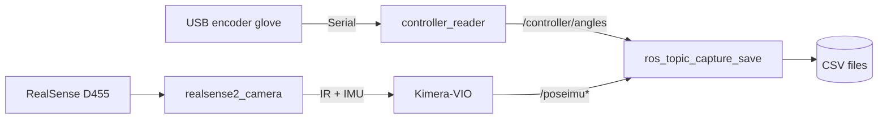

# UMI-Dex


**Languages:** English (this file) · [简体中文](README_zhCN.md)

UMI-Dex is a ROS 2–based dexterous-hand teleoperation data collection stack. It synchronously records the operator’s hand joint angles and end-effector pose using a homologous glove (USB serial encoders) and visual-inertial odometry (VIO), producing aligned CSV datasets for imitation learning or action replay.

This workspace uses **Intel RealSense D455 + Kimera-VIO** (via `realsense2_camera` and `kimera_vio_ros`) instead of OpenVINS. The capture script still expects **`/poseimu`** (`geometry_msgs/PoseWithCovarianceStamped`); if your Kimera install publishes a different topic or message type, add a relay/remap so that data is available on `/poseimu` before recording.

## Architecture



\*Ensure VIO output is exposed as `geometry_msgs/PoseWithCovarianceStamped` on `/poseimu` (see [Run](#run)).

## Requirements

- **ROS 2** (tested on Jazzy)
- **Python**: `rclpy`, `pyserial` (see [requirements.txt](requirements.txt))
- **ROS packages** (install separately for your distro):
  - `realsense2_camera`
  - `kimera_vio_ros` (or your Kimera ROS 2 package; launch file allows overriding package/executable names)
- **Hardware**: 6-DOF USB serial encoder glove, Intel RealSense D455

## Hardware documentation

Mechanical STEP models for the L6 glove, PCB STEP files, and usage notes are under [`hardware/`](hardware/). See [hardware/README.md](hardware/README.md) ([简体中文](hardware/README_zhCN.md)).

## Get the source

```bash
git clone <your-fork-or-repo-url>
cd <repo-root>
```

This tree ships **ROS 2 packages** under `src/` (`controller_reader`, `kimera_vio_bringup`). There is **no OpenVINS submodule** in this layout; VIO is provided by the external Kimera-VIO stack.

## Build

```bash
source /opt/ros/jazzy/setup.bash
colcon build
source install/setup.bash
```

To build only this repository’s packages:

```bash
colcon build --packages-select controller_reader kimera_vio_bringup
```

## Hardware and udev

For CAD/PCB assets (STEP, EasyEDA), see [Hardware documentation](#hardware-documentation) above.

The 6-DOF encoders use a CH343 USB–serial bridge. For a stable device path on each plug-in, use the udev rule shipped with `controller_reader`:

```bash
cd src/controller_reader/script
sudo bash bind_usb.sh
```

This installs `l6encoder_usb.rules` under `/etc/udev/rules.d/` so CH343 devices get a symlink at `/dev/l6encoder_usb`. Set `serial_port` to `/dev/l6encoder_usb` in `src/controller_reader/config/controller_reader_params.yaml`.

## Run

Use several terminals and start the following in order.

### 1. Controller / encoder node

```bash
source install/setup.bash
ros2 launch controller_reader controller_reader.launch.py
```

Override the serial port from the launch file:

```bash
ros2 launch controller_reader controller_reader.launch.py serial_port:=/dev/ttyUSB1
```

If launch fails, check serial devices: `ls /dev/tty*`.

### 2. RealSense + Kimera-VIO

```bash
source install/setup.bash
ros2 launch kimera_vio_bringup d455_kimera_vio.launch.py
```

Useful launch arguments (see [d455_kimera_vio.launch.py](src/kimera_vio_bringup/launch/d455_kimera_vio.launch.py)):

| Argument | Description |
|----------|-------------|
| `use_stereo:=true` | Enable stereo IR (infra1 + infra2) |
| `rviz_enable:=true` | Start RViz2 |
| `kimera_package:=...` | Kimera ROS 2 package name (default `kimera_vio_ros`) |
| `kimera_executable:=...` | Node executable (default `kimera_vio_ros_node`) |
| `kimera_params_file:=/abs/path.yaml` | Kimera parameter file |

Ensure your Kimera pipeline publishes (or is remapped to) **`/poseimu`** as `geometry_msgs/PoseWithCovarianceStamped` before starting the capture script.

### 3. Topic capture

```bash
cd script
python3 ros_topic_capture_save.py
```

Common options:

| Option | Description | Default |
|--------|-------------|---------|
| `-o DIR` | Output directory | `output_topics_YYYYMMDD_HHMMSS` |
| `-t SEC` | Duration in seconds; `0` = stop with Ctrl+C | `0` |
| `--no-pose` | Do not subscribe to `/poseimu` | — |
| `--no-controller` | Do not subscribe to `/controller/angles` | — |

## Topics and CSV output

### ROS 2 topics

| Topic | Type | Description |
|-------|------|-------------|
| `/controller/angles` | `std_msgs/Float32MultiArray` | 6-DOF joint angle mapped values (0–1023) |
| `/controller/angles_raw` | `std_msgs/Float32MultiArray` | Raw 6-DOF angles (can be disabled via params) |
| `/poseimu` | `geometry_msgs/PoseWithCovarianceStamped` | 6DoF pose for capture (from your VIO / bridge) |

### CSV output

The capture script writes two CSV files in the output directory:

**pose_imu.csv**

| Column | Description |
|--------|-------------|
| `timestamp_sec`, `timestamp_nsec` | Timestamp from the pose message header (`msg.header.stamp`) |
| `pos_x`, `pos_y`, `pos_z` | Position |
| `orient_x`, `orient_y`, `orient_z`, `orient_w` | Orientation quaternion |

**controller_angles.csv**

| Column | Description |
|--------|-------------|
| `timestamp_sec`, `timestamp_nsec` | Local clock when the node received the sample (`node.get_clock().now()`) |
| `angle_0` – `angle_5` | Mapped control values for six joints |

> **Note:** The two CSVs use different timestamp sources. `pose_imu.csv` uses the VIO/pose message `header.stamp`; `controller_angles.csv` uses the node’s local clock because encoder messages do not carry a standard timestamp header. Account for this when aligning data.

## License

This project is licensed under the [Apache License 2.0](LICENSE).
