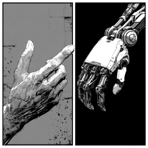

# UMI-Dex



**Documentation:** English (this file) · [简体中文](README_zhCN.md) · [Docs index / 文档索引](docs/README.md)

UMI-Dex is a dexterous-hand teleoperation data collection pipeline. It records hand joint angles (USB serial encoder glove) and end-effector trajectory (visual-inertial odometry) on a shared timeline for imitation learning, replay, and downstream data processing.

The current implementation uses a **PC-local Intel RealSense D455 + ORB-SLAM3 (stereo-inertial)** workflow managed by `uv`. Trajectory estimation and time-synced export are done directly inside the capture process, without relying on `kimera_vio_ros` or a `/poseimu` bridge.

## Current Features (PC)

- RealSense D455 stereo IR + IMU capture
- ORB-SLAM3 stereo-inertial trajectory estimation
- USB controller angle capture (raw + mapped values)
- Offline alignment and visualization for trajectory/controller data

## Requirements

- Python 3.12+
- `uv` installed (recommended)
- Intel RealSense D455 (required for capture)
- Optional controller serial device (default `/dev/l6encoder_usb`)

## Setup

1) Install `uv` if needed:

```bash
curl -LsSf https://astral.sh/uv/install.sh | sh
```

2) Create and sync the project environment:

```bash
uv sync
```

3) Activate the virtual environment:

```bash
source .venv/bin/activate
```

4) Download the ORB-SLAM3 vocabulary into `config/` (first run only):

```bash
curl -L "https://github.com/UZ-SLAMLab/ORB_SLAM3/raw/master/Vocabulary/ORBvoc.txt.tar.gz" -o ./config/ORBvoc.txt.tar.gz
tar -xzf ./config/ORBvoc.txt.tar.gz -C ./config
rm ./config/ORBvoc.txt.tar.gz
```

## Main Workflow (Recommended)

1) Start interactive recording (script entry):

```bash
uv run python script/interactive_record.py \
  --vocab ./config/ORBvoc.txt \
  --settings ./config/intel_d455.yaml \
  --out_dir ./outputs/realtime_map
```

2) Visualize trajectory (script entry):

```bash
MPLCONFIGDIR="$(pwd)/.mplcache" uv run python script/visualize_trajectory.py \
  --traj ./outputs/realtime_map/trajectory.txt \
  --points ./outputs/realtime_map/tracked_points.xyz \
  --out_dir ./outputs/realtime_map/plots \
  --traj_only
```

3) Optional: align trajectory with controller data:

```bash
uv run align-trajectory \
  --traj ./outputs/realtime_map/trajectory.txt \
  --controller ./outputs/realtime_map/controller_angles.csv \
  --out ./outputs/realtime_map/trajectory_controller_aligned.csv
```

## Interactive Recording Controls (Terminal)

Start command:

```bash
uv run record-interactive \
  --vocab ./config/ORBvoc.txt \
  --settings ./config/intel_d455.yaml \
  --out_dir ./outputs/realtime_map
```

Key bindings:

- `s`: start recording
- `c`: stop current recording and save outputs
- `r`: delete/reset previous output directory contents (destructive)
- `q`: quit controller

Notes:

- `r` is disabled while recording; press `c` first.
- The interactive controller spawns `orb_runner` as a child process and performs safe shutdown on stop.
- Interactive mode suppresses normal `orb_runner` logs and only forwards warning/error/traceback output.
- Launcher implementation is in `script/interactive_record.py`.

## Debug/Development Commands (Advanced)

Use these for direct `orb_runner` testing and low-level troubleshooting:

```bash
uv run orb-run \
  --vocab ./config/ORBvoc.txt \
  --settings ./config/intel_d455.yaml \
  --out_dir ./outputs/realtime_map \
  --disable_controller_capture
```

```bash
uv run orb-run \
  --vocab ./config/ORBvoc.txt \
  --settings ./config/intel_d455.yaml \
  --out_dir ./outputs/realtime_map \
  --controller_port /dev/l6encoder_usb
```

Other retained wrapper commands:

```bash
uv run record-interactive --help
uv run visualize-trajectory --help
uv run record-realsense --out ./recordings/session_001
```

## Sample Data (Coming Soon)

Public high-quality sample data will be released after the current device/data pipeline reaches target quality criteria.

## Output Files (`--out_dir`)

- `trajectory.txt`
- `tracked_points.xyz`
- `map_info.json`
- `export_summary.json`
- `orb_frame_times.csv`
- `run_clock_info.csv`
- `controller_angles.csv` (generated when controller capture is enabled)

## Usage Notes and Troubleshooting

- Linux serial permissions: if controller connection fails, verify serial permissions (`dialout` group or udev rules).
- If `orbslam3` import fails, rerun `uv sync` and verify your `uv` environment.
- Use `--disable_controller_capture` for trajectory-only tests.
- In restricted environments, use `MPLCONFIGDIR="$(pwd)/.mplcache"` for visualization.

## Project Layout

- Pipeline code: `src/linker_umi_dex/`
- Interactive recorder launcher: `script/interactive_record.py`
- Trajectory visualization script: `script/visualize_trajectory.py`
- ORB resources/config: `config/intel_d455.yaml`, `config/ORBvoc.txt`
- Runtime outputs: `outputs/`, `recordings/`

## License Notes

- Project code is licensed under [Apache License 2.0](LICENSE).
- Third-party dependencies (including ORB-SLAM3 and `orbslam3-python`) follow their respective licenses.
