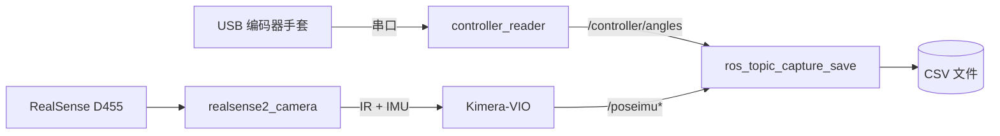
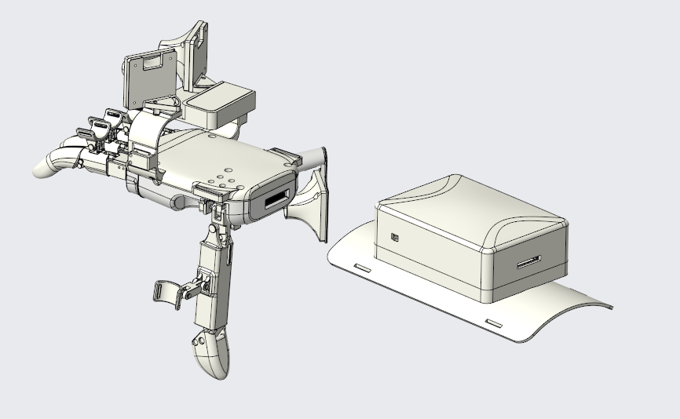

# UMI-Dex


**文档与语言：** [English](README.md) · 简体中文（本页）· [文档索引](docs/README.md)

UMI-Dex 是一套基于 ROS 2 的灵巧手遥操作数据采集系统，通过同构手套（USB 串口编码器）与视觉惯性里程计（VIO）同步录制操作者的手部关节角度与末端位姿，输出对齐的 CSV 数据集，用于后续的模仿学习或动作回放。

本工作空间采用 **Intel RealSense D455 + Kimera-VIO**（通过 `realsense2_camera` 与 `kimera_vio_ros`），而非 OpenVINS。录制脚本仍要求话题 **`/poseimu`**（`geometry_msgs/PoseWithCovarianceStamped`）；若你安装的 Kimera 发布在其它话题或消息类型上，请在录制前通过转发/重映射等方式，使数据以 `/poseimu` 上的 `PoseWithCovarianceStamped` 形式可用。

## 系统架构



\*需将 VIO 输出以 `geometry_msgs/PoseWithCovarianceStamped` 形式发布在 `/poseimu` 上（见 [运行](#运行)）。

## 依赖

- **ROS 2**（已在 Jazzy 上测试）
- **Python**：`rclpy`、`pyserial`（见 [requirements.txt](requirements.txt)）
- **ROS 软件包**（请按发行版单独安装）：
  - `realsense2_camera`
  - `kimera_vio_ros`（或你使用的 Kimera ROS 2 包；launch 支持覆盖包名与可执行文件名）
- **硬件**：6 轴 USB 串口编码器手套、Intel RealSense D455

## 硬件设计资料

L6 手套机械 STEP、PCB 模型与使用说明位于 [`hardware/`](hardware/) 目录。详见 [hardware/README_zhCN.md](hardware/README_zhCN.md)（[English](hardware/README.md)）。

## 获取源码

```bash
git clone <your-fork-or-repo-url>
cd <repo-root>
```

本仓库在 `src/` 下提供 **ROS 2 功能包**（`controller_reader`、`kimera_vio_bringup`）。当前布局中 **不包含 OpenVINS 子模块**；VIO 由外部的 Kimera-VIO 栈提供。

## 编译

```bash
source /opt/ros/jazzy/setup.bash
colcon build
source install/setup.bash
```

若仅编译本仓库自有包：

```bash
colcon build --packages-select controller_reader kimera_vio_bringup
```

## 硬件与 udev 配置

 

机械结构、PCB 等设计文件说明见上文 [硬件设计资料](#硬件设计资料)。

本项目使用的 6 轴编码器基于 CH343 USB 转串口芯片。为了让设备在每次插入时都获得固定的设备路径，可使用 `controller_reader` 随附的 udev 规则：

```bash
cd src/controller_reader/script
sudo bash bind_usb.sh
```

该脚本会将 `l6encoder_usb.rules` 安装到 `/etc/udev/rules.d/`，使 CH343 设备自动创建 `/dev/l6encoder_usb` 符号链接。之后在 `src/controller_reader/config/controller_reader_params.yaml` 中将 `serial_port` 设置为 `/dev/l6encoder_usb` 即可。

## 运行

需要打开多个终端，按顺序启动以下进程。

### 1. 启动控制器 / 编码器节点

```bash
source install/setup.bash
ros2 launch controller_reader controller_reader.launch.py
```

支持通过 launch 参数覆盖串口：

```bash
ros2 launch controller_reader controller_reader.launch.py serial_port:=/dev/ttyUSB1
```

如果启动失败，可先检查串口设备：`ls /dev/tty*`。

### 2. 启动 RealSense + Kimera-VIO

```bash
source install/setup.bash
ros2 launch kimera_vio_bringup d455_kimera_vio.launch.py
```

常用 launch 参数（详见 [d455_kimera_vio.launch.py](src/kimera_vio_bringup/launch/d455_kimera_vio.launch.py)）：

| 参数 | 说明 |
|------|------|
| `use_stereo:=true` | 开启双目红外（infra1 + infra2） |
| `rviz_enable:=true` | 启动 RViz2 |
| `kimera_package:=...` | Kimera ROS 2 包名（默认 `kimera_vio_ros`） |
| `kimera_executable:=...` | 节点可执行文件名（默认 `kimera_vio_ros_node`） |
| `kimera_params_file:=/绝对路径.yaml` | Kimera 参数文件 |

启动录制脚本前，请确认 Kimera 管线已发布（或已重映射到）**`/poseimu`**，且消息类型为 `geometry_msgs/PoseWithCovarianceStamped`。

### 3. 启动话题录制

```bash
cd script
python3 ros_topic_capture_save.py
```

常用参数：

| 参数 | 说明 | 默认值 |
|------|------|--------|
| `-o DIR` | 输出目录 | `output_topics_YYYYMMDD_HHMMSS` |
| `-t SEC` | 录制时长（秒），`0` 表示按 Ctrl+C 停止 | `0` |
| `--no-pose` | 不订阅 `/poseimu` | — |
| `--no-controller` | 不订阅 `/controller/angles` | — |

## 话题与 CSV 说明

### ROS 2 话题

| 话题 | 消息类型 | 说明 |
|------|----------|------|
| `/controller/angles` | `std_msgs/Float32MultiArray` | 6 轴关节角度映射值（0–1023） |
| `/controller/angles_raw` | `std_msgs/Float32MultiArray` | 6 轴原始角度（可通过参数关闭） |
| `/poseimu` | `geometry_msgs/PoseWithCovarianceStamped` | 供录制的 6DoF 位姿（来自 VIO / 桥接节点） |

### CSV 输出

录制脚本在输出目录下写入两个 CSV 文件：

**pose_imu.csv**

| 列名 | 说明 |
|------|------|
| `timestamp_sec`, `timestamp_nsec` | 位姿消息头中的时间戳（`msg.header.stamp`） |
| `pos_x`, `pos_y`, `pos_z` | 位置 |
| `orient_x`, `orient_y`, `orient_z`, `orient_w` | 四元数姿态 |

**controller_angles.csv**

| 列名 | 说明 |
|------|------|
| `timestamp_sec`, `timestamp_nsec` | 节点接收样本时的本地时钟（`node.get_clock().now()`） |
| `angle_0` – `angle_5` | 6 个关节的映射控制值 |

> **注意：** 两个 CSV 的时间戳来源不同。`pose_imu.csv` 使用 VIO/位姿消息的 `header.stamp`；`controller_angles.csv` 使用节点本地时钟，因为编码器消息不携带标准时间戳头。在做数据对齐时需考虑这一差异。

## 参与贡献

欢迎各种形式的贡献！请阅读 [贡献指南](CONTRIBUTING.md) 了解详情。

- [行为准则](CODE_OF_CONDUCT.md) — 我们共同遵守的社区规范
- [安全政策](SECURITY.md) — 如何私下报告安全漏洞

## 许可证

本项目基于 [Apache License 2.0](LICENSE) 开源，希望整个行业和生态越来越好 ❤️