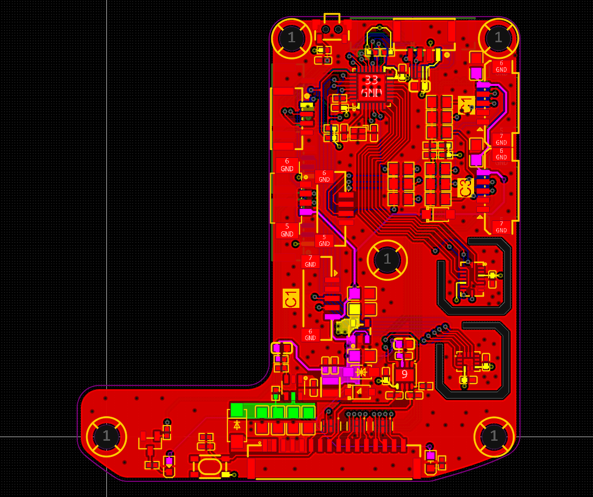
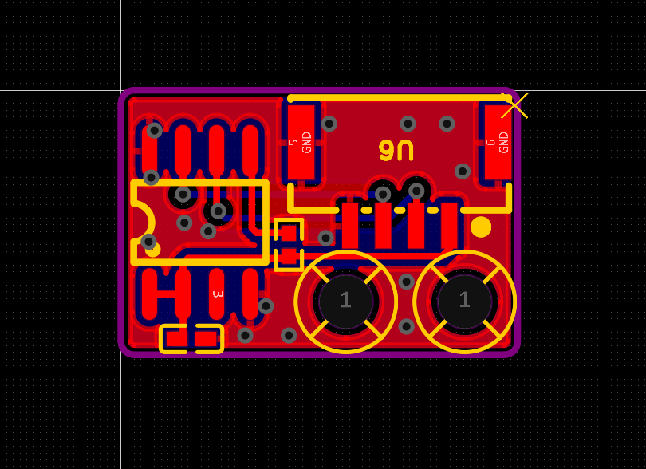

# Hardware

**Languages:** English (this file) · [简体中文](README_zhCN.md)

This directory contains mechanical CAD (STEP) and PCB-related assets for reproducing and manufacturing UMI-Dex hardware. For the full software stack and system overview, see the repository root [README](../README.md).

## Contents

| Location | Description |
|----------|-------------|
| [`L6-TG-STEP/`](./L6-TG-STEP/) | L6 6-DOF serial encoder glove: STEP parts and main assembly |
| Repository root (this folder) | Encoder PCB STEP, dual-IMU / encoder-reading PCB STEP, EasyEDA project, and preview images |

---

## L6 glove mechanics (`L6-TG-STEP/`)

STEP models for the L6 6-DOF USB serial encoder glove: individual parts and the main assembly. Use them in CAD for drawings, CNC, or 3D printing.

**File overview:**

| Kind | Examples / notes |
|------|------------------|
| Main assembly | `1-l6-_v100001.stp` — full assembly (large file) |
| Thumb / fingers | `thumb-*.stp`, `finger-*.stp`, `finger-strap.stp`, `finger-root.stp`, etc. |
| Covers | `l6-top-cover.stp`, `l6-botto-cover.stp`, `screen-cover.stp`, etc. |
| Cameras | `camera-mount-l.stp`, `camera-mount-r.stp`, `camera-zhijia-1.stp`, `carema-cover.stp` |
| Board area (3588 in filename) | `3588-pcb-top-cover.stp`, `3588-pcb-bottom-cover.stp` |
| Links & strap | `link-*.stp`, `arm-strap-1.stp` |
| Fastener stand-ins | `m1-6.stp`, `m2-5.stp`, `m2-8.stp`, `m2-12.stp`, `m2-16.stp` |
| Other | `magnet.stp`, etc. |

Additional `.stp` files in the folder are sub-parts; treat filenames as the source of truth.

---

## PCBs and previews (files in this directory)

Encoder reading and dual-IMU related PCB assets. The EasyEDA project is `UMI-Dex-PCB.epro2`.

### Encoder board

| File | Description |
|------|-------------|
| `UMI-Dex Encoder Board.step` | 3D STEP model of the encoder board |

### Dual IMU and encoder reading board

| File | Description |
|------|-------------|
| `UMI-Dex_Dual IMU and encoder reading.step` | 3D STEP model for the dual-IMU / encoder-reading PCB |

### PCB project overview

 

| File | Description |
|------|-------------|
| `UMI-Dex-PCB.epro2` | EasyEDA project — open to edit and export Gerbers / manufacturing data |

---

## Usage notes

- **STEP**: Open with FreeCAD, Fusion 360, SolidWorks, or similar. Large assemblies may load slowly.
- **PCB**: Open `.epro2` in [EasyEDA](https://easyeda.com/) (or a compatible toolchain). Verify BOM, stack-up, and fab rules with your manufacturer before ordering boards.
